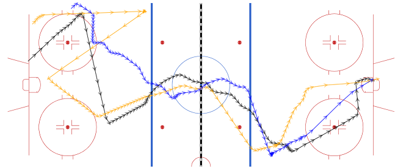
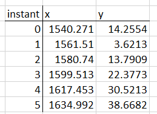
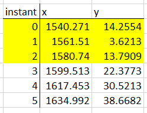
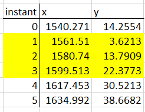
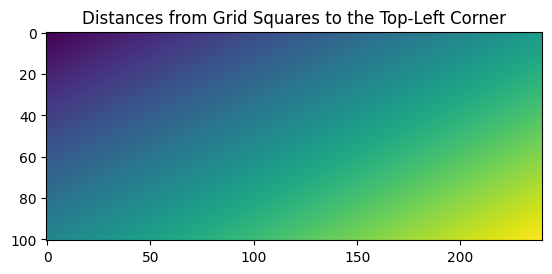

# Introduction

This command-line tools finds similar NHL goals using puck tracking data, hyperdimensional computing, and sliding windows.
While the tracking data for goals includes player tracking information as well, only puck data is used here.  **Player tracking data is not used.**

Example: for [this Florida Panthers goal](https://www.nhl.com/ppt-replay/goal/2024020788/706), the two most similar 2024-2025 regular season goals based on the puck's paths are [this Winnipeg Jets goal](https://www.nhl.com/ppt-replay/goal/2024021086/424) and [this Calgary Flames goal](https://www.nhl.com/ppt-replay/goal/2024021264/600).  Below is a visualization of these three goals:



The black path represents the Panthers goal, the orange path represents the Jets goal, and the blue path represents the Flames goal.  Arrows show the direction the puck moved, and the bigger the space between arrows, the faster the puck moved.

# Data

The data used is the puck tracking data that creates the goal visualizations, such as those found in the example goal pages linked above.  I created a tool to download that data, which you can find [here](https://github.com/danielglin/nhl_goal_tracking_data).

Pre-processing the data includes trimming the starts and ends of the data.
There are goals that start with a faceoff where the data includes information before the puck is dropped.  One example is [this Seattle Kraken goal](https://www.nhl.com/ppt-replay/goal/2024020543/538).  The portion of the data before play starts is removed.
Goals also have information after the puck enters the net, which needs to be removed as well.
For example, [this Dallas Stars goal](https://www.nhl.com/ppt-replay/goal/2024020168/300) has a lot of data after the puck enters the net, including much of the goal celebration.

Goals are also rotated so that the puck always enters the net on the right side of the rink.

# Usage

Since the program is written in Rust, you can use Cargo to run it.

To specify the goal you want to find similar goals of, use the `--game` and `--goal` options, which take game and goal ids respectively.
You can find those ids in the URL of the goal visualization pages.
For example, the above Panthers goal's visualization page has the URL `https://www.nhl.com/ppt-replay/goal/2024020788/706`.  The game id is the second to last part, `2024020788`, and the goal id is the last part, `706`.

The program finds the two most similar goals based on the puck's path.

You can either specify a directory of goal tracking files with the `--input-dir` option or use previously saved intermediate data with the `--import-info` flag and specify the directory to import from with the `--import-dir` option.  Importing saved data can be faster than reading goal tracking files and re-processing them.

Input directory example using Cargo: 
```
$ cargo run --release -- --game 2024020788 --goal 706 --input-dir "data/"
```

This command finds the two most similar goals to goal 706 in game 2024020788 using the goal tracking data files in the `data/` folder.

To save intermediate data for later use, use the `--export-hvs` and `--export-grid-perm` flags with the `--output-dir` option to specify the directory to save to.

Saving intermediate data example using Cargo:
```
$ cargo run --release -- --game 2024020788 --goal 706 --input-dir "data/" --export-hvs --export-grid-perm --output-dir "exported_data/"
```
This command finds the two most similar goals to goal 706 in game 2024020788 and saves intermediate data to the `exported_data` directory for later use.  You could also use the exported goal hypervectors for various analyses.

Importing data example using Cargo:
```
$ cargo run --release -- --game 2024021111 --goal 821 --import-info --import-dir "exported_data/" 
```
This command finds the two most similar goals to goal 821 in game 2024021111 using the saved data in the `exported_data/` directory.

Due to the randomness used in the approach, results may differ slightly from run to run.

# Methodology

To find similar goals, the program uses hyperdimensional computing, also known as Vector Symbolic Architecture, with sliding windows.

## Sliding Windows

Each goal is represented as a sequence of (x, y) coordinates in the tracking data:



If we set the window size to be 3, the first window is:



The step size is how far the window slides from one window to the next.  A step size of 1 would cause the next window to be:



We repeat this process until we hit the end of the sequence of coordinates.

Each window gets encoded as a vector using hyperdimensional computing.

The program uses a window size of 7 and a step size of 1.

## Hyperdimensional Computing Background

This section gives a brief overview of hyperdimensional computing.  For more a more detailed introduction, I recommend checking out [[1]](#resources).

Hyperdimensional computing (HDC) encodes data using high-dimensional random vectors, with 10,000 dimensions being common.
There are several different kinds of vectors used in HDC, such as binary (all values are either 0 or 1), polar (all values are either -1 or 1), or real (all values are real numbers).
These vectors are called **hypervectors**.  The hypervectors used here are binary and have 5,000 dimensions.

There are several hypervector operations:
1. Bundling
2. Binding
3. Permutation
4. Distance/Similarity

**Bundling** together hypervectors results in a hypervector that's similar to all of the hypervectors that were bundled.  Here, the bundling operation is majority vote.  For example, bundling the hypervectors `[0, 1, 1, 0, 1], [0, 0, 0, 0, 1], [1, 0, 1, 0, 1]` results in `[0, 0, 1, 0, 1]`.  Ties become 0.  To find the first element, we see that the most common first element across the three hypervectors is 0, so 0 is the first element.  

**Binding** together two hypervectors results in a hypervector that's different from all of the hypervectors that were bound.  Here, the binding operation is exclusive or.

**Permutation** shuffles the order of the elements in a hypervector.

**Distance** is measured here as the number of elements that are different between two hypervectors.  Here, we use Hamming distance, which is the number of positions where the elements are different.

The overall process of representing a goal as a hypervector is:
1. Encode each window as a hypervector
    1. Represent each instant in the window using the instants' coordinates
    2. Bind together all the instant hypervectors in the window to form the window hypervector
2. Bundle all the window hypervectors together

## Encoding a Window

Each instant in a window is represented by an (x, y) coordinate. 
In order to encode a coordinate as a hypervector, this approach uses **grid level hypervectors**.

Level hypervectors are used to represent scalar values as hypervectors.
A range is broken up into equally-sized bins. 
We use a random hypervector to for the first bin.
Then we change a fixed number of elements in the hypervector to get the hypervector for the next bin.
We continue this process until we have a hypervector for each bin.

Grid level hypervectors build upon the idea of level hypervectors to represent a grid of coordinates.
Each square in the grid gets assigned a hypervector as follows.
Starting at a corner of the grid, we use a random hypervector to represent that corner square.
Half of this corner hypervector will be gradually flipped to represent different columns.
The other half will be gradually flipped to represent different rows.
Then for any given square in the grid, we flip the elements corresponding to the square's column and row.

Below is a plot of distances from each square's hypervector to the top-left corner's hypervector.
Cooler colors are smaller distances, while warmer colors are larger distances.
The grid has 240 columns and 101 rows.



The rink is broken down into a grid of the same size.
Each instant's coordinates, which are originally floating point, get scaled and converted to integers to be assigned a grid square.
That grid square's hypervector is then permuted.
Each position in the window has its own specified permutation.
That means the first instant in the window is always permuted in the same way, the second instant is always permuted in its own way, etc.
All the permuted grid level hypervectors are bound together to form the window's hypervector.

Written out as a formula, the window hypervector $w$ for a window of size $n$ is:

$$w = \rho_1 (g_1) \circ \rho_2 (g_2) \circ ... \circ \rho_n (g_n)$$
where $\circ$ represents binding following the notation used in [[1]](#resources), $\rho_i$ is the permutation used for instant $i$, and $g_i$ is the grid level hypervector for the coordinate at instant $i$.

## Encoding a Goal

Once we have all the window hypervectors for a goal, we create the final goal hypervector by bundling those window hypervectors.  

As a formula, the goal hypervector $\gamma$ for a goal with $m$ windows is:

$$\gamma = w_1 + w_2 + ... + w_m$$
where $+$ is the bundle operation following the notation used in [[1]](#resources).

Once all the goal hypervectors have been created, to find the most similar goals given a specific goal, we calculate the distances from the given goal to all other goals and take the goals with the smallest distances.

# Future Work

Beyond finding goals similar to a given goal, these goal hypervectors could be used for clustering or finding goals where the puck follows some specified path.

The goal encoding could be improved upon by including the player tracking data and by tweaking the window and step sizes.

# Resources

1. Stock M, Van Criekinge W, Boeckaerts D, Taelman S, Van Haeverbeke M, Dewulf P, et al. (2024) Hyperdimensional computing: A fast, robust, and interpretable paradigm for biological data. PLoS Comput Biol 20(9): e1012426. https://doi.org/10.1371/journal.pcbi.1012426

